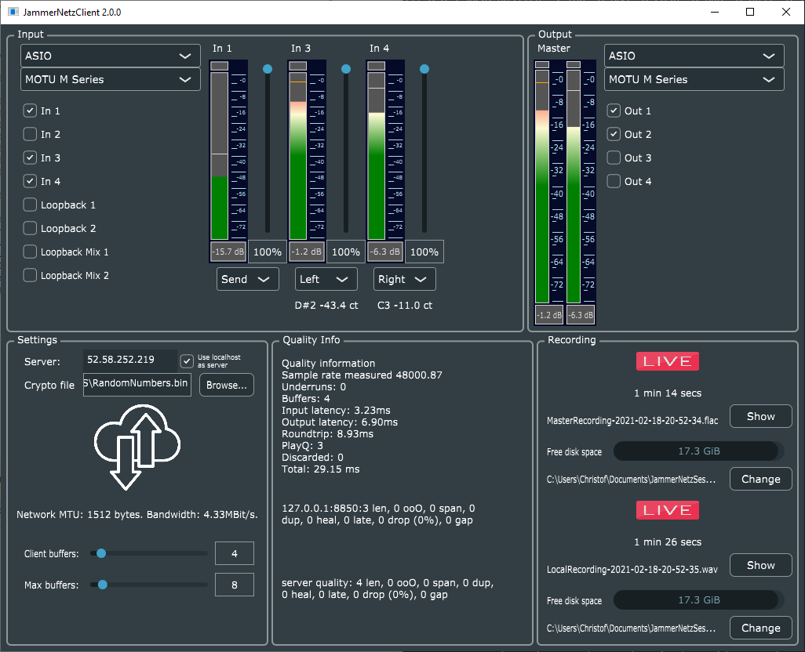

# Introduction

JammerNetz is an Open Source system for "networked music performance" (NMP), also known as "jamming over the internet". It consists of a lightweight server software, and a little UI client software that can use your audio devices and stream multiple uncompressed high-quality audio channels to other participants as a common mixdown.

The design choice is that if you have a modern DSL or fibre connection there is no need to degrade your music experience using CODECs mostly designed for speech transmission as used in some other internet jam solutions. We are happily using JammerNetz since over two years for our weekly sessions with synths, voice, and electric guitar.

Of course be aware that the main influence on the quality has your internet provider and your choice where you are running the server. If you have high quality fibre and a good and fast ASIO-capable audio interface, you can expect 50ms total air-to-air latency, which we think is awesome. Of course, if some participants are bound for cable internet and are trying to play together across all of Germany, even running the server in a suitable AWS instance in Frankfurt close to the internet's main hub will not get you much better than 70-80 ms total audio latency (including AD and DA conversion in your interface), which we feel is still worth the effort! Do not try to use WiFi.

## Features

JammerNetz is quite feature rich, the following are the main items:

  * It allows you to host a jam session on a server, allowing a configurable number of clients to participate.
  * It allows for channel configuration to send mono or stereo channels, and also a "send-only" channel type for using microphones without hearing your own voice. This makes for great communication during the session.
  * Send multiple audio channels per client to the server, e.g. your synthesist can send the keyboards and his voice separately.
  * Does automatic hard-disk recording of your session to local disk on each client in a lossless compressed FLAC file. After the session, everybody has a record to revisit.
  * Does automatic MIDI recording in case it detects any incoming MIDI notes, thereby logging all keys played into a MIDI file for later revisit ("what did I play? Sounds great!")
  * Features a built-in instrument tuner display showing you the detected note and cents for each channel, so it is easy and quick to get everybody on the same A.
  * BlowFish encryption based on a shared secret, so you are not sending data unsecured through the internet. We don't claim this is state of the art and probably not enough bits of encryption, but better than sending unencrypted audio data. This certainly is a point for improvement.

## Screenshot

Here is a screenshot

### Limitations

It should be noted that due to the design of the system, we have a few limitations or restrictions that other systems might not have. We believe that we have made sensible trade-offs, but your milage may vary:

  1. All clients need to run on the same sample rate (48000 is set in the source, but you might want to switch to 44100 in file BuffersConfig.h).
  2. The network packets are set to 128 buffer size, which we feel is the best trade off between number of packets per second, MTU, and latency. The Audio device can run in different / biffer buffer sizes now, but be aware that this might increase latency and require bigger jitter buffers on the server (command line parameter on the server!).
  3. As we are aiming for lowest-possible latency, you should really use an audio device with ASIO drivers on Windows, even if Windows Audio in different modes is offered. Stay away from DirectSound. Mac CoreAudio works as well very nicely, as does Jack on Linux.

## Usage

We provide installers for Windows and Mac client to download here in the release section. The server executable is also installed by the Windows installer for you to test it e.g. locally, but for real life application you'd need to run the server somewhere in the cloud.

you will need some experience in compiling a C++ application and starting an AWS (or Azure or self-hosted or...) instance and deploying the Linux build of the server there to run it. Depending on the interest in this system, we might be able to provide more help.

# Building the software

### Supported platforms

We use JUCE, a cross-platform library with support for all major platforms, but we have tested the client software at the moment only on Windows 10 using MS Visual Studio 2019 and macOS 10.15, and the server on an up-to-date Ubuntu Linux 20.04 LTS. Other platforms might work as well, but might require some fiddling and fixing.

## Downloading

Clone with submodules from github

    git clone --recurse-submodules -j8 https://github.com/christofmuc/JammerNetz

The recursive clone with  submodules is required to retrieve the following additional modules already into the right spot inside the source tree:

1. We use the magnificent [JUCE library](https://juce.com/) to immensly reduce the amount of work we have to do.
2. the nice JUCE module [ff_meters](https://github.com/ffAudio/ff_meters) from ffAudio to display the level meters for each channel.
3. [Q](https://github.com/cycfi/Q), a highly interesting modern C++ DSP library we use for the instrument tuning/pitch detection. Go check it out, it's really cool!
4. [Infra](https://github.com/cycfi/infra), a little helper library required by Q.
5. [Flatbuffers](https://google.github.io/flatbuffers/), a C++ serialization library we use for parts of the network protocol.

As we don't want to send any unencrypted audio data through the internet, we use a simple BlowFish encryption scheme to make sure that only authorized people join the jam session. More on that below.

## Installing more dependencies with Conan

We are moving towards Conan 2.1 for dependency management, and in order to include the pdcurses library on Windows, just run the following conan install command before building from within the JammerNetz top-level-directory:

    conan install -of Builds\Windows -s build_type=Release --build missing .

In case you do not have conan installed, have a look at their documentation and [download page](https://conan.io/downloads.html). It is a great tool!

## Build mode (development vs release)

`JAMMERNETZ_ENABLE_LTO` controls link-time optimization:

- Development default: `OFF` (faster local rebuild and link times).
- Release/CI: set `-DJAMMERNETZ_ENABLE_LTO=ON` explicitly.

Release configuration example:

    cmake -S . -B builds -G Ninja -DCMAKE_BUILD_TYPE=Release -DJAMMERNETZ_ENABLE_LTO=ON
    cmake --build builds --parallel

## Building on Windows

We use modern [CMake 3.14](https://cmake.org/) and Visual Studio 2022 Build Tools for C++. The default generator in this repository is Ninja, so make sure `ninja` is installed and you build from a Developer Command Prompt / Developer PowerShell so MSVC is available.

Optionally, if you want to produce a Windows-style installer for your band members: We always recommend the [InnoSetup](http://www.jrsoftware.org/isinfo.php) tool, really one of these golden tools that despite its age shines on and on. Download it and install it, it will automatically be picked up and used by the build process.

Using CMake and building JammerNetz client and server is a multi-step build:

    cd third_party\flatbuffers
    cmake -S . -B Builds -G Ninja -DCMAKE_BUILD_TYPE=Release
    cmake --build Builds --parallel
    cd ..\..
    cmake -S . -B Builds\Windows -G Ninja -DCMAKE_BUILD_TYPE=Release
    cmake --build Builds\Windows --parallel

For optimized release builds (CI setting), explicitly enable LTO:

    cmake -S . -B Builds\Windows -G Ninja -DCMAKE_BUILD_TYPE=Release -DJAMMERNETZ_ENABLE_LTO=ON
    cmake --build Builds\Windows --parallel

The build will take a few minutes, and produce Release versions of Client and Server software, as well as a client installer in case you have InnoSetup installed before kicking off. The installer executable is created as `<JammerNetzDir>\Builds\Client\jammernetz_setup_x.x.x.exe`

To test it, you can launch the server on your local machine with

    <JammerNetzDir>\Builds\Server\Release\JammerNetzServer.exe -k [nameOfSecretsFile]

Simply use the "connect to local server" checkbox of the client.

## Building on macOS

We tested on macOS Mojave 10.15:

First install your prerequisites with brew:

    brew install cmake gtk+3 glew ninja

Then run

    cd third_party/flatbuffers
    cmake -S . -B LinuxBuilds -G Ninja -DCMAKE_BUILD_TYPE=Release
    cmake --build LinuxBuilds --parallel
    cd ../..
    cmake -S . -B Builds/macOS -G Ninja -DCMAKE_BUILD_TYPE=Release
    cmake --build Builds/macOS --parallel

## Building the server for Linux on Windows

Most likely, you're not going to run your server on a Windows machine but prefer a Linux cloud machine located at some strategic position in the Internet.

### Cross-platform building Linux server on Windows 10 using Docker

Thanks to Docker, it has never been easier to do cross-platform development on Windows. If you don't have it, get yourself [Docker Desktop](https://www.docker.com/products/docker-desktop) and experience the power!

### Building the Linux version from command line

After installing Docker Desktop, we're ready to do a cross-platform build for Linux.

First, what we are going to do is to create a docker image for the build machine we are going to use. For that, open a command line, cd into the directory &lt;JammerNetzDir&gt;\Server\docker\buildmachine and run the command

    buildBuildmachine.bat

You can build the Linux version from a Windows command line by just running the provided batch file inside the buildmachine directory. You need to specify the JammerNetz top level directory in the funky Docker volume syntax with forward slashes and a double slash for the drive letter. E.g. the Windows directory D:\Development\JammerNetz needs to be specfied as //d/Development/JammerNetz:

    makeLinux.bat //d/Development/JammerNetz

This is so the Linux virtual machine will mount the source directory from the host, and directly place it's build output on the host, so the virtual machine is immediately removed again after the build is finished.

You will find the output of the Build machine in the directory &lt;JammerNetzDir&gt;\Server\Builds\LinuxMakefile\build. The server executable is just called "JammerNetzServer" and is ready to run on a matching Linux machine.

### Deploying the Linux build to a real Ubuntu server

The build above produced a Linux executable. If you have an Ubuntu server running you want to use, e.g. an Amazon EC2 instance, you can copy the executable to the server e.g. with scp, then dial into the machine with ssh and launch it. For example (from within the `<JammerNetz>` directory, use the IP of your server of course):

    scp Builds\LinuxBuilds\Server\JammerNetzServer ubuntu@192.168.172.1:.

Then dial into your server, using ssh or putty, and make sure to have all runtime prequisites installed. With that done, you can just launch the server:

    apt-get install -y libtbb-dev libasound2-dev libjack-dev
    ./JammerNetzServer -k [nameOfSecretsFile]

The server should start up and announce its presensence with a happy

    Server listening on port 7777
    Starting JammerNetz server, using CTRL-C to stop

All clients should be able to connect to the server via its IP address.

## Native Linux builds

If you are working on Linux, make sure to have all development prerequisites installed!

The JUCE documentation has this somewhat hidden at https://github.com/juce-framework/JUCE/blob/master/docs/Linux%20Dependencies.md.

### Debian/Ubuntu

On a fresh Debian 9 machine, that would e.g. require the following installs:

    sudo apt-get -y install g++ libasound2-dev libcurl4-openssl-dev libfreetype6-dev libncurses-dev libjack-dev libx11-dev libglew-dev mesa-common-dev webkit2gtk-4.1 libwebkit2gtk-4.1-dev cmake webkit2gtk3-devel.x86_64

	sudo apt update
	# This is what we need extra:
	sudo apt install g++ cmake libncurses-dev libglew-dev
	# This is what the JUCE documentation specifies:
	sudo apt install libasound2-dev libjack-jackd2-dev \
		ladspa-sdk \
		libcurl4-openssl-dev  \
		libfreetype-dev libfontconfig1-dev \
		libx11-dev libxcomposite-dev libxcursor-dev libxext-dev libxinerama-dev libxrandr-dev libxrender-dev \
		libwebkit2gtk-4.1-dev \
		libglu1-mesa-dev mesa-common-dev

### Fedora

For a Fedora-based distribution like Amazon Linux 2, you would use `yum` to install the dependencies:

	# TODO - this needs updating for JUCE8
    sudo yum install alsa-lib-devel libcurl-devel freetype-devel ncurses-devel jack-audio-connection-kit-devel libX11-devel  mesa-libGL-devel webkitgtk4-devel glew-devel

### Compilation

With those installs and the recursive git clone from above, cd into the cloned directory and run cmake with the following commands:

    cmake -S . -B builds -G Ninja
    cd third_party/flatbuffers
    cmake -S . -B LinuxBuilds -G Ninja -D FLATBUFFERS_CXX_FLAGS="-Wno-error"
    cmake --build LinuxBuilds --parallel
    cd ../..
    cmake --build builds --parallel

This should have created a server binary as `builds/Server/JammerNetzServer` and a client binary as `builds/Client/JammerNetzClient`.

To launch the server, just type

    ./builds/Server/JammerNetzServer -k [nameOfSecretsFile]

and it shall listen on port 7777. If you omit the -k you can use unencrypted traffic, then the client also needs a blank secrets file path. Recommended for testing only.

The gcc version seems to matter, I am testing with a vanilla Ubuntu 18.04 LTS installation which comes with gcc 7.5.0 out of the box.

## The encryption secrets

Earlier versions had the 72 random bytes required for the Blowfish encryption compiled into the executable. But now the secrets are read from the command line by the server, and the client has a browse to... feature to select a file with the secret key. The encryption is symmetric, so both the server and all clients need to have the same secrets file, and the secure distribution of the key is left to the user.

To generate the shared secret, create a file e.g. named RandomNumbers.bin and specify this in the command line when launching the server, and distribute to the clients for selecting in the UI.

For example, you can use an external source like https://www.random.org/bytes/ to generate 72 random bytes, or use a more trustworthy key source as you like, or on Linux and Mac use your random device:

    head -c 72 /dev/urandom > JammerNetz-secret.bin

## Similar systems

We had used the great [Jamulus](https://github.com/jamulussoftware/jamulus) system before developing our own system, and JammerNetz certainly has been inspired by this great piece of software. Please note that JammerNetz was created in pre-pandemic times, and also before Jamulus got its extra surge in community activity.

We also made some substantial design and architecture changes over Jamulus, justifying a new development instead of contributing to the Jamulus codebase. Most importantly, while Jamulus is using Qt as a cross-platform library, JammerNetz uses JUCE, massively reducing the lines of code required.

## Licensing

As some substantial work has gone into the development of this, I decided to offer a dual license - AGPL, see the LICENSE.md file for the details, for everybody interested in how this works and willing to spend some time her- or himself on this, and a commercial MIT license available from me on request. Thus I can help the OpenSource community without blocking possible commercial applications.

## Contributing

All pull requests and issues welcome, I will try to get back to you as soon as I can. Due to the dual licensing please be aware that I will need to request transfer of copyright on accepting a PR.

## Special thanks

Special thanks go to our contributors, namely Viktor for helping in creating the first build for macOS!

## About the author

Christof is a lifelong software developer having worked in various industries, and can't stop his programming hobby anyway.
