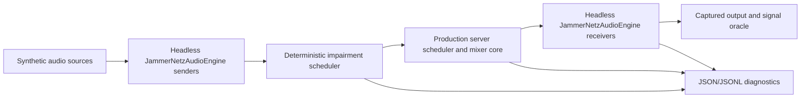

# JammerNetz Automated Testing Strategy

Status: active, living strategy

Last updated: 2026-08-19

Foundations: [PR #56](https://github.com/christofmuc/JammerNetz/pull/56) extracted the reusable audio engine; [PR #63](https://github.com/christofmuc/JammerNetz/pull/63) implemented the deterministic headless QA foundation.

This document is the overview, roadmap, and technical design reference for automated JammerNetz testing. It should evolve with the product and record both what is protected today and what still depends on characterization or manual validation.

## 1. Overview

### 1.1 Purpose

JammerNetz has years of successful use in real music performances over real German Internet connections. Automated testing should preserve that proven behavior, make known edge cases reproducible, and give network, buffering, and mixer changes objective evidence.

Automation complements rather than replaces rehearsal, real audio-interface testing, geographically distributed sessions, and occasional validation with operating-system network shapers. The strategy deliberately adds realism in layers so that failures can first be reproduced quickly and deterministically, then confirmed through the real transport and operating system.

The central acceptance question is not merely whether the server remains connected. It is:

> Did every receiver render the expected sources in the correct order and alignment, and if not, what glitched, why, and when did coherent output return?

### 1.2 Guiding principles

- Test receiver output, not only server state or packet counters.
- Prefer deterministic virtual-time reproducers for mixer and buffering policy.
- Keep known defects as characterization until a replacement invariant is agreed; then convert them into red tests before implementing the fix.
- Separate lossless survival, audible damage, recovery, and persistent failure.
- Keep the fast pull-request suite independent of UI, audio devices, wall-clock sleeps, and privileged network tools.
- Add real UDP and operating-system shaping as independent validation layers rather than making deterministic tests less reproducible.
- Preserve failure artifacts and seeds so every automated failure can be replayed locally.

### 1.3 Current coverage

| Layer | Status | What it covers | Execution |
| --- | --- | --- | --- |
| Unit and component tests | Implemented | Audio engine, packet queues, mixer routing, scheduler decisions, connection state, deterministic test helpers | Every pull request on Windows, Ubuntu, and macOS |
| Clean headless system tests | Implemented | Two- and four-client sample-exact mixing through real client engines and the production server mixer | Every pull request on Windows, Ubuntu, and macOS |
| Object-level network impairment | Implemented | Lag, jitter, loss, bursts, duplication, reordering, hold/flush, combinations, and receiver quality surfaces | Weekly and manually triggered characterization workflow |
| Reconnect characterization | Partially implemented | Five deterministic boundary orderings and a bounded 2,000-iteration stale-underrun concurrency test | Weekly and manually triggered characterization workflow |
| Real UDP and serialized datagrams | Not implemented | Sockets, kernel queues, serialization, encryption, MTU, malformed datagrams, and real reconnect establishment | Planned |
| Operating-system network shaping | Not implemented | Independent validation with Linux network emulation and Clumsy or equivalent on Windows | Planned |
| Real audio-device and geographic validation | Manual | Driver behavior, physical clock drift, callback deadlines, hardware compatibility, and actual WAN behavior | Release/rehearsal validation |

The current harness is strong for deterministic mixer, queue, and client playout correctness. It is not yet a complete test of the network transport because impairment is injected at the `JammerNetzAudioData` object boundary.

### 1.4 Current clean-network guarantees

The merge-gating suite currently proves:

- A two-client reference mix remains sample-exact for at least 1,000 network frames.
- Four clients remain sample-exact with repeating callback sizes below, equal to, and above the 128-sample network frame, including 32, 64, 128, 256, 512, and 1,024 samples.
- Receiver-specific self-echo, local monitoring, channel routing, per-channel volume, master volume, BPM/MIDI selection, addressing, and session metadata preserve the extracted production behavior.
- Synthetic generation, scheduling, signal comparison, and traces replay deterministically.
- Late audio callbacks are safe during engine shutdown.

### 1.5 Current network findings

The measured baseline uses 48 kHz audio, 128-sample network frames, three server jitter frames, and a five-frame maximum server queue. One network frame is approximately 2.667 ms; four frames are approximately 10.7 ms and eight frames are approximately 21.3 ms.

- Clean traffic is sample-exact at both receivers.
- Fixed lag, bounded jitter, and periodic hold/flush remain receiver-sample-exact through two frames with the corrected latency-overflow policy and first glitch at four frames. Periodic reordering remains sample-exact through four frames and first glitches at eight frames.
- Immediate duplicates remain sample-exact at every tested rate, including every second packet.
- Every tested non-zero unhealed packet-loss rate creates a receiver discrepancy. Without usable redundancy, later recovery cannot make the lost interval lossless.
- Every tested periodic loss rate and loss burst now returns to eight coherent server mixes within the recovery window; the lost interval still produces a receiver discrepancy.
- All tested combinations now recover server coherence. The isolated 32-frame bounded-jitter profile remains the first server recovery failure in the current matrix.
- With no slotting, only the zero-loss cells through two jitter frames are sample-exact. With two-frame slotting, only zero-loss/zero-jitter is sample-exact. Four- and eight-frame slotting glitch even with no other jitter or loss.
- All profiles in the current bounded receiver matrix eventually regain eight sequential coherent frames; that is recovery, not lossless operation or a long-duration stability guarantee.

The hold/flush tests originally reproduced two related architectural weaknesses. First, queue pressure from one stream granted global permission to drain unrelated streams; issue #76 corrected this with local fast-forward/rebase. Second, the all-stream readiness barrier made every participant's download depend on every participant's upload. Issue #96 replaces that barrier with a stable, observable cadence donor, keeps all connected participants in the recipient roster, and classifies each source independently as packet, concealment, or silence. The room timeline and output sequence continue when one upload chops, including for the affected uploader, without growing the jitter buffer.

The reconnect characterization also records two unresolved outcomes:

- A same-endpoint reset-counter packet that wins the exact grace-deadline ordering can leave the client connected with an empty queue.
- A delayed packet from an old counter generation can be accepted after a completed same-endpoint reconnect.

### 1.6 What the current results do not claim

The current quality surface is an empirical result for the tested frame size, sample rate, buffer constants, impairment cadence, deterministic pattern, and bounded observation window. It is not an Internet service-level guarantee.

In particular, it does not yet cover:

- actual UDP sockets, kernel queues, serialization, encryption, or process boundaries;
- MTU changes, fragmentation, malformed or byte-tampered datagrams;
- real thread wake-up timing, CPU starvation, or callback deadlines;
- independent physical sender clocks and long-term sample-rate drift;
- real audio drivers, device restarts, or unsupported hardware;
- long-duration soak behavior or a broad randomized fault search.

## 2. Plan

### 2.1 Completed: Milestone 1, deterministic headless foundation

Milestone 1 is complete. PR #63 delivered:

1. **CI baseline**
   - CTest labels, timeouts, and JUnit results.
   - Unit and clean system execution on Windows, Ubuntu, and macOS pull requests.
   - A weekly/manual characterization workflow with uploaded artifacts.

2. **Deterministic test support**
   - Synthetic sequential-identity audio, captured output, a virtual-time scenario scheduler, a signal oracle, and JSONL trace writing.
   - Unit tests for repeatability, same-time event ordering, discrepancy coalescing, non-finite sample detection, and artifact writing.

3. **Audio packet injection seam**
   - A narrow `AudioPacketSink` boundary below `JammerNetzAudioEngine`.
   - Production continues to delegate to the existing client transport; tests capture equivalent audio packet objects.

4. **Step-driven server mixer**
   - Production scheduling and mixing decisions extracted from `MixerThread` into synchronous, testable components.
   - Behavior-preservation tests for routing, self-echo, metadata, clock/control selection, addressing, and malformed channel metadata.

5. **Clean end-to-end scenarios**
   - Two-client reference and four-client variable-callback merge gates.
   - Real headless client engines on both the transmit and receiver playout sides.

6. **Known-problem characterization**
   - One-shot and periodic hold/flush sweeps.
   - Isolated Clumsy-style profiles, two- and three-impairment combinations, and a jitter/loss/slotting quality surface.
   - Deterministic reconnect ordering results and bounded threaded stress.

### 2.2 Convert findings into regression protection

This is the highest-value next milestone.

#### 2.2.1 Completed: fix queue-pressure chronology test-first

Use [issue #76](https://github.com/christofmuc/JammerNetz/issues/76) as the design and acceptance record.

1. Added focused one-shot and receiver-level periodic eight-frame hold/flush regressions.
2. Required unaffected client queues to retain their jitter reserve when another stream exceeds its maximum depth.
3. Removed global queue overrun as permission to drain all streams.
4. Fast-forward only the oversized stream to the target depth, retaining its newest packets.
5. Rebase that stream's gap/FEC state so intentional fast-forward does not create synthetic fill-in packets for the discarded interval.
6. Added sustained simulated clock-skew coverage to verify that faster streams remain bounded without shifting unrelated queue depth.
7. Added runtime and JSONL observability for local rebases and per-source contribution classification.

The required contract is:

- Lossless delay, jitter, reorder, duplication, and hold/flush remain sample-exact within the supported buffer boundary.
- Unhealed loss may create a documented discontinuity or concealment, but must not create persistent inter-source skew.
- Latency-budget overflow uses a deliberate and observable local fast-forward/rebase policy.

#### 2.2.2 Completed: isolate upload faults from room output cadence test-first

Use [issue #96](https://github.com/christofmuc/JammerNetz/issues/96) as the design and acceptance record.

1. Added focused red regressions proving that a missing upload stopped its own download and that one slotted participant stopped four stable participants.
2. Made the active recipient roster independent from the sources contributing to the current mix.
3. Added a server-owned, monotonic output sequence shared by every receiver for each room tick.
4. Selected a deterministic healthy cadence donor and bounded its recent-health score. A previously contributing ready source takes over immediately when the donor stalls; even a new source takes over after one network-frame grace, so historical health can never deadlock the room while a new bursty client still cannot steal healthy cadence.
5. Kept the latency budget fixed: a missing source contributes bounded concealment or silence for that tick; no adaptive jitter growth is introduced.
6. Extended deterministic traces with cadence changes and packet/concealment/silence attribution.
7. Verified through real headless receive engines that stable audio remains exact at both the stable participant and the impaired uploader while only the impaired source chops.
8. Added repeated drop/recovery/drop lifecycle and audio-outage regressions, plus severe jitter, long hold, duplicate-burst, and loss combinations.
9. Kept RTT stable during an upload outage by accepting only newer echoed upload timestamps; repeated cached recipient metadata no longer turns one upload fault into an ever-growing latency reading.

The required contract is:

- Upload errors may chop that participant's contribution, but not the entire room mix.
- Every connected participant remains a download recipient even when its current upload is absent.
- One high-jitter or slotted participant cannot control stable-room cadence or expand the room latency budget.
- Cadence selection, failover, source degradation, queue rebase, and server output sequence are deterministic and observable.
- A ready cadence candidate cannot be rejected forever because its historical health score is lower than the missing donor's score.

#### 2.2.3 Define and fix reconnect generation semantics

1. Decide whether a same-endpoint reconnect with a reset message counter is valid and how it establishes a new generation.
2. Turn the exact-deadline empty-queue outcome into a focused failing regression test.
3. Reject or explicitly classify delayed old-generation packets after reconnect.
4. Extend the deterministic matrix across accept, mixer, receiver playout, grace expiry, endpoint replacement, and old/new packet delivery.
5. Extend bounded stress to the complete generation transition rather than only packet arrival versus stale underrun.
6. Require every active receiver to regain coherent playout within a documented bound after reconnect.

### 2.3 Expand deterministic characterization

After the two known defects have explicit contracts:

- Run multiple deterministic seeds for jitter and combination families.
- Add longer virtual-time campaigns and selected soak profiles.
- Add independent sender clock-rate offsets and changing drift.
- Add correlated and stateful loss models in addition to periodic loss and fixed bursts.
- Sweep relevant buffer constants and later supported sample rates/frame sizes.
- Record the historical Clumsy profiles used during original development as named presets.
- Compare scheduled summaries against a versioned baseline and flag boundary regressions automatically.
- Generate plots from the JSON quality surfaces for human review.
- Decompose transport, server queue, mix barrier, and receiver playout latency as proposed in [issue #80](https://github.com/christofmuc/JammerNetz/issues/80).

Characterization should remain deterministic and replayable. Random exploration is valuable only when the seed, schedule, and minimized failure trace are preserved.

### 2.4 Add a real-UDP automated layer

The next realism layer should retain synthetic audio and headless clients while replacing the object-level packet endpoint with the real transport.

It should exercise:

- production serialization and deserialization;
- encryption/authentication and malformed-packet rejection;
- UDP socket behavior and kernel queues;
- actual process or endpoint reconnect establishment;
- MTU discovery, datagram size boundaries, truncation, and fragmentation-sensitive behavior;
- a controllable UDP impairment proxy for delay, jitter, loss, duplication, reordering, throttling, and hold/flush.

The deterministic object-level profiles should be reusable as proxy schedules where possible. Running the same named profile through both layers will show whether the synthetic model accurately predicts real transport behavior.

Real-UDP tests should initially run as scheduled jobs. A small stable subset can become pull-request gates once execution time and flakiness are understood.

### 2.5 Add operating-system and hardware validation

- Add scheduled Linux operating-system network shaping as an independent check of the UDP proxy.
- Add a self-hosted Windows job using Clumsy or an equivalent tool for historical profile compatibility.
- Keep a documented manual release matrix for real audio interfaces, driver/device restart, actual callback timing, and geographically distributed sessions.
- Consider hardware-in-the-loop only for a small set of stable reference devices; do not require a fake ASIO/CoreAudio/WASAPI/ALSA device for core mixer testing.

Direct calls to `JammerNetzAudioEngine::process()` are the preferred artificial audio device for algorithmic tests. An operating-system fake device is useful only when testing device discovery, buffer-size negotiation, sample-rate changes, driver callbacks, or restart behavior.

### 2.6 CI policy

| Cadence | Required suites | Purpose |
| --- | --- | --- |
| Every pull request | `unit`, `system`, and promoted network regression profiles | Fast deterministic correctness and preserved known-good boundaries |
| Weekly/manual today | `characterization`, `stress` | Full impairment matrix, quality surfaces, reconnect exploration, and artifacts |
| Future scheduled | Multi-seed/long-duration deterministic runs and real UDP | Boundary trends, broader search, and transport validation |
| Release candidate | OS-shaped UDP, selected hardware, and geographic rehearsal | Environment and integration confidence that hosted CI cannot provide |

Known bad outcomes may remain non-blocking characterization data, but these conditions must always fail automation:

- crashes, deadlocks, sanitizer findings, or timeouts;
- non-deterministic replay of a deterministic profile;
- missing or internally inconsistent artifacts;
- accounting errors between generated, delivered, delayed, duplicated, and dropped packets;
- failure of the clean receiver control;
- regression of a profile explicitly promoted as a supported boundary.

## 3. Design

### 3.1 Layered test architecture



The current deterministic path substitutes only packet delivery, time, and audio-device callbacks. It deliberately exercises production audio framing, server queue/scheduler decisions, receiver-specific mixing, client playout buffering, and final rendering.

The future real-UDP layer replaces the deterministic packet delivery edge with production serialization, sockets, and a controlled UDP proxy. The signal source, receiver oracle, and profile definitions should remain reusable.

### 3.2 Virtual time and scenario scheduling

The scenario scheduler owns a monotonic clock measured in samples. At 48 kHz with 128-sample frames, one frame is approximately 2.667 ms.

A deterministic scenario explicitly orders:

1. client callback production;
2. formation of zero or more outgoing network frames;
3. impairment and packet delivery to the server;
4. one server scheduling/mixing decision;
5. receiver-specific packet delivery;
6. client playout callbacks and captured output.

Events scheduled for the same virtual sample retain a recorded sequence number. Replaying a profile must produce the same trace and result on every supported platform.

Correctness tests do not use wall-clock sleeps. The reconnect stress test uses explicit synchronization barriers so that concurrency boundaries are exercised without relying on accidental timing.

### 3.3 Synthetic signal and provenance

Every source tracks an absolute sequential sample number. Audio values use a bounded deterministic sequence derived from:

```text
(source id, channel id, absolute sample number)
```

This avoids floating-point precision loss from ever-growing integer ramps while keeping every sample attributable to a source and position. The source remains repeatable across arbitrary callback boundaries.

The test harness keeps provenance alongside packet objects and correlates it through existing message counters and server time. No test-only fields are added to the production wire protocol.

### 3.4 Headless client and packet seam

A headless client owns:

- a `JammerNetzSession` and real `JammerNetzAudioEngine`;
- a synthetic input source and captured output;
- channel setup, local monitoring, echo, and gain configuration;
- a repeating callback-size schedule;
- source and rendered sample counters;
- a test `AudioPacketSink` connected to the scenario scheduler.

The engine's production `process()` entry point remains under test. The test does not duplicate production framing, local monitoring, gain, routing, transmit buffering, receive preparation, or playout behavior.

The packet seam carries production-equivalent `JammerNetzAudioData` semantics but currently excludes bytes, encryption, and sockets. Receiving uses the production `enqueueRemoteAudio()` and playout path.

### 3.5 Server scheduling and mixer core

Production waiting remains in `MixerThread`; synchronous scheduling and mixing live in `ServerMixScheduler` and `ServerMixerCore`. Tests can therefore execute exactly one decision without sleeping or running a production thread loop.

The extracted core exposes:

- the reason a mix did or did not run;
- queue snapshots before and after the decision;
- the cadence donor, donor changes, and server-owned output sequence;
- selected source packet counters and packet/concealment/silence classification;
- deliberate local fast-forward events, discarded counts, and the oldest retained counter;
- connection transitions and activity generations;
- an active recipient roster independent of current contributors;
- receiver-specific output packets, addressing, metadata, clock, and control selection.

The extraction was intended to preserve production policy. Policy corrections discovered by the harness belong in separate test-first changes.

### 3.6 Signal oracle and synchronization definitions

For every rendered sample, the oracle derives the expected result from source sequences, routing, volume, receiver-specific self-echo, local monitoring, server mix position, and client playout position. Adjacent differences are coalesced into discrepancy spans rather than emitted as thousands of assertions.

Three properties remain distinct:

1. **Source continuity:** each source position advances once. Missing positions are gaps, repeated positions are replays, and decreasing positions indicate reordering.
2. **Mix coherence:** source contributions selected for a receiver mix represent the intended relative positions. No source should silently remain a frame ahead or behind another after recovery.
3. **Receiver agreement:** content differs because self-echo may be excluded, but common remote contributions retain the same relative alignment at every receiver.

Latency is a separate measurement. A connected server, coherent server counters, and sample-exact receiver output answer different questions and must not be collapsed into one status.

### 3.7 Clean system scenarios

#### Two-client reference

- Two distinct mono sources, one routed left and one right.
- Self-echo disabled and local monitoring enabled.
- Identical 128-sample callbacks.
- At least 1,000 mixed frames after startup.
- Exact assertions for source continuity, mix time, receiver-specific exclusion, local monitoring, and absence of unexpected fill-in/discard/underrun/connection transitions.

#### Four-client variable callbacks

- Four distinct sources with representative routing.
- Callback schedules containing 32, 64, 128, 256, 512, and 1,024 samples.
- Staggered activation and at least ten seconds of virtual audio after activation.
- Sample-exact output, zero relative source skew, bounded queues, and identical replay results.

Focused unit/component tests cover `Mute`, `Left`, `Right`, `Mono`, `SendLeft`, `SendRight`, `SendMono`, echo, monitoring, volume, missing channel metadata, clock/control selection, and output addressing.

### 3.8 Impairment model

The progressive model mirrors the original manual Clumsy workflow: enable one impairment, increase severity, identify the last supported and first failing boundary, then repeat with selected combinations.

Each standard progressive profile uses:

- 16 clean warm-up frames;
- 96 generated impairment frames;
- at least 64 normal-delivery recovery frames;
- eight consecutive coherent frames as the bounded recovery window.

The current isolated profile families are:

- fixed lag: 1, 2, 4, 8, 16, and 32 frames;
- bounded deterministic jitter: 0 through the same maximum delays;
- periodic single-packet drops: one per 64 through one per two frames;
- periodic loss bursts: 1, 2, 3, 4, and 8 frames every 32 frames;
- immediate duplicates: one per 64 through one per two frames;
- periodic reordering displacement: 1, 2, 4, 8, and 16 frames;
- periodic hold/throttle: 1, 2, 4, 8, 16, and 32 held frames every 32 frames;
- a separate one-shot hold/flush sweep with release-order variations.

Combination families currently cover low, medium, and high levels of:

- jitter plus loss;
- jitter plus reordering;
- hold plus duplication;
- lag plus loss;
- jitter plus loss plus duplication;
- jitter plus loss plus reordering;
- jitter plus long periodic hold plus duplicate bursts;
- repeated loss windows with 8/24, 16/16, and 24/8-frame drop/recovery duty cycles.

Focused robustness regressions additionally exercise a participant dropping, reconnecting,
and dropping again, repeated upload outages without download interruption, and a severe
jitter/hold/duplicate/loss profile. These cases assert isolation at unaffected receivers,
equal room-output cadence for the impaired uploader, and bounded recovery after each outage.

Clumsy's byte-tampering function is intentionally absent from the object-level layer. It must operate on serialized datagrams or real UDP so malformed-packet rejection is tested meaningfully.

### 3.9 Receiver quality and statistics

Every receiver records:

- rendered and compared frames;
- glitch frames, percentage, first/last glitch, and longest glitch run;
- discrepancy spans, mismatched channel samples, and maximum absolute error;
- unmatched output frames and output discontinuities;
- silent frames/runs after startup;
- maximum playout skew and recovery frames;
- underruns, discarded frames, receive-queue overruns, and prepared-queue high-water mark.

Server-side results separately record connection state, coherent mix windows, source skew, mix triggers, queue sizes/high-water marks, fill-in and single-source mixes, and packet-stream quality counters.

Receiver outcome classes are:

- `sample_exact` (score 2): both receivers render every observed post-start sample exactly and never underrun;
- `glitched_but_recovered` (score 1): at least one receiver glitches, but both later render eight identifiable sequential frames;
- `persistent_failure` (score 0): at least one receiver does not regain that coherent window.

The quality surface crosses five jitter values and seven loss rates across four slotting facets, producing 140 plot-ready cells. Stable lossless audio means `sample_exact`, not merely server recovery.

### 3.10 Reconnect characterization

The current deterministic matrix records five orderings:

- packet arrival before a stale underrun decision;
- packet arrival after underrun but before grace expiry;
- grace expiry before a reset-counter packet;
- reset-counter packet immediately before expiry at the deadline;
- delayed old-counter packet after completed reconnect.

The bounded threaded test repeats packet arrival against a stale underrun decision 2,000 times and requires the client to remain connected with the accepted packet queued.

This coverage proves the activity-generation guard for that narrow race. It does not yet prove the complete accept/mix/playout reconnect lifecycle or establish an unambiguous old/new packet-generation policy.

### 3.11 Artifacts and observability

Structured traces may contain:

```text
virtual sample and time
event sequence number and seed
client and activity generation
source/message counter
server mix epoch and trigger
queue sizes and high-water marks
connection state and transition
delivery action: paced, delayed, held, flushed, dropped, or duplicated
receiver playout state
first discrepancy, gap, repeat, or recovery window
```

Current artifacts are written below the build tree:

- CTest JUnit results;
- hold/flush `summary.json` and per-case JSONL traces;
- isolated and combined impairment summaries and per-profile JSONL traces;
- quality-surface `quality-surface/hold-N/summary.json` facets;
- disconnect/reconnect `summary.json`.

The weekly/manual workflow uploads `builds/test-artifacts` and the characterization JUnit file even when a test fails. Future additions should include a compact scenario manifest and, where useful, a short WAV excerpt around the first audible discrepancy.

### 3.12 Test organization

CTest labels are:

- `unit`: focused production components and deterministic test helpers;
- `system`: clean deterministic multi-client scenarios;
- `characterization`: degraded conditions and observed boundaries;
- `stress`: bounded concurrent reconnect exploration.

Pull-request workflows execute `unit|system`. The `Network Characterization` workflow executes `characterization|stress` every Monday and on manual dispatch, then publishes its reports.

The implementation lives primarily in:

- [`test_support/DeterministicAudioTestSupport.*`](../test_support/DeterministicAudioTestSupport.h)
- [`integration_tests/CleanNetworkSystemTests.cpp`](../integration_tests/CleanNetworkSystemTests.cpp)
- [`integration_tests/NetworkImpairmentCharacterizationTests.cpp`](../integration_tests/NetworkImpairmentCharacterizationTests.cpp)
- [`integration_tests/ReconnectCharacterizationTests.cpp`](../integration_tests/ReconnectCharacterizationTests.cpp)
- [`integration_tests/ReconnectStressTests.cpp`](../integration_tests/ReconnectStressTests.cpp)
- [`Server/Source/ServerMixScheduler.*`](../Server/Source/ServerMixScheduler.h)
- [`Server/Source/ServerMixerCore.*`](../Server/Source/ServerMixerCore.h)
- [`Client/Source/JammerNetzAudioEngineTests.cpp`](../Client/Source/JammerNetzAudioEngineTests.cpp)
- [`.github/workflows/network-characterization.yaml`](../.github/workflows/network-characterization.yaml)

### 3.13 Future real-UDP design

A real-UDP harness should use the same synthetic sources, named impairment profiles, and receiver oracle. A controllable proxy between actual endpoints should timestamp and schedule serialized datagrams without understanding already-decoded audio objects.

The first version can run all endpoints on one host to test production sockets and bytes reproducibly. Later OS-shaped and multi-host jobs validate kernel/network behavior independently. Each layer should report the same core metrics so results can be compared:

```text
deterministic object model -> controlled UDP proxy -> OS shaper -> real WAN
```

Differences between adjacent layers are evidence: they reveal transport, scheduling, or environment behavior missing from the simpler model.

### 3.14 Maintaining this strategy

Every network, buffering, scheduler, reconnect, FEC, or playout change should answer:

1. Which layer demonstrates the problem before the change?
2. What receiver-level invariant defines success?
3. Is the case a merge gate, a known-failure characterization, or a scheduled experiment?
4. Which metrics and artifacts make a failure diagnosable?
5. Does a real-UDP or OS-shaped confirmation add material confidence?

When a characterization defect is fixed, preserve its reproducer, change its expected invariant, and promote the narrowest stable case into the pull-request regression suite. Do not preserve historical bad output as the desired behavior.
