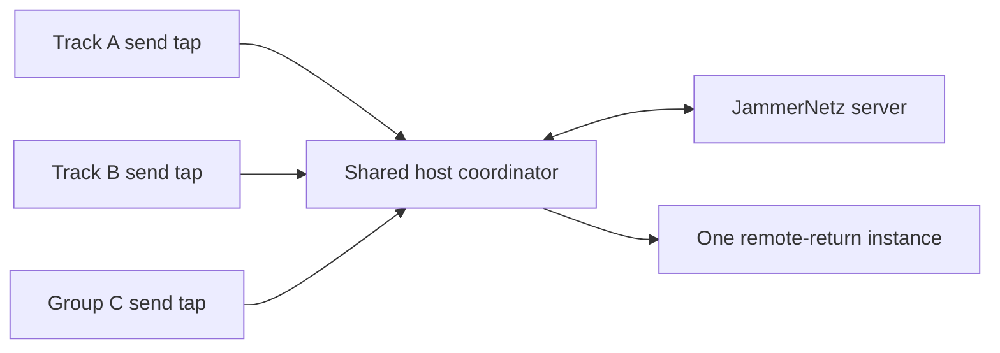
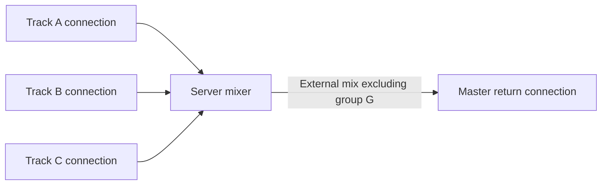
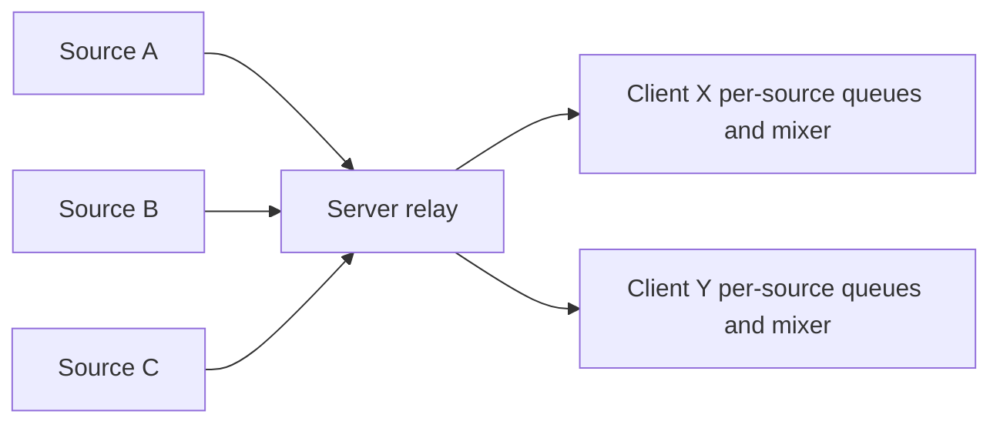

# Multi-instance Plug-in and Audio Distribution Architecture

## Status

Exploration document. No implementation decision has been made.

The current product policy remains one active JammerNetz plug-in session per host process. This document records the use cases, architectural options, and experiments needed before changing that policy.

## Purpose

A DAW can instantiate JammerNetz on several tracks, groups, returns, or the master bus. Allowing all of those instances to connect is technically possible, but the desired result depends on questions that are more fundamental than plug-in instance management:

- Should every participant hear the same mix?
- Should a musician hear their own signal locally, through the server, or both?
- Are DAW chains separate named stems or merely inputs to one stereo contribution?
- Is the server a mixer, a selective mixer, or an audio relay?
- Is one UDP flow per DAW project preferable to one flow per chain?
- How much server, client, and network cost is acceptable as the session grows?

The answers vary between acoustic playing, electronic performance, recording, and broadcast use cases. We should collect and prioritize those use cases before selecting an architecture.

## Current architecture and constraints

### Client identity and transport

The server currently identifies a client by its observed UDP endpoint: IP address plus source port. Every `JammerNetzSession` binds a local port and owns its socket, sender, and receive thread. Multiple plug-in processors could therefore establish separate connections, provided the process-wide active-session lease were removed.

The server would see those instances as independent clients even when they belong to the same Ableton project. It currently has no durable concept of:

- host or machine identity;
- DAW project identity;
- a group of related client endpoints;
- a stable source or channel identity across reconnects;
- a receive-only or send-only participant.

### Current per-client mix

The server consumes one stream from every active client and produces a client-specific stereo mix. A sender can request that its own channels are omitted from its returned mix, enabling zero-latency local monitoring without an audible echo.

The exclusion applies only to the sending endpoint. If two plug-in instances A and B connect independently, the server considers A to be remote from B and B to be remote from A.

If both instances pass their local chains through and add their server returns, a typical master sum becomes:

```text
A output = A dry + B returned + external mix
B output = B dry + A returned + external mix

Master = 2 x A + 2 x B + 2 x external mix
```

Removing the active-session lease alone would therefore produce duplicate local and remote audio.

### Audio packet size

JammerNetz sends uncompressed floating-point audio in UDP datagrams. A normal stereo network frame is deliberately small. Combining many stereo stems into one multichannel datagram can exceed the path MTU even while remaining below the protocol's much larger maximum frame buffer.

IP fragmentation makes a large audio frame fragile: losing any fragment loses the complete datagram. A multichannel design must therefore account for the practical path MTU, not merely `MAXFRAMESIZE` or the engine's maximum channel count.

Separate stereo connections preserve smaller datagrams and isolate packet loss, but increase packet count, independent queues, server scheduling work, and jitter interactions.

## Candidate use cases

These use cases should be validated with musicians before implementation.

### U1: One master-bus contribution

The current plug-in model. Ableton produces one stereo mix, one JammerNetz instance sends it, and the same instance adds the remote return.

Priority: supported baseline that must not regress.

### U2: Several named DAW stems, one shared remote return

Examples include separate synthesizer, drum-machine, vocal, and guitar chains. Each chain should be visible as a distinct source or channel pair in the session, while external audio is returned exactly once on the master or a dedicated return track.

Questions:

- Must the server retain separate fader and routing control for every stem?
- Can the stems be mixed to stereo in the DAW before transmission?
- How many simultaneous stereo stems are realistic?

### U3: Several independent JammerNetz sessions

Different plug-in instances may intentionally connect to different servers or sessions. Their audio returns are unrelated, so independent network sessions may be the correct model.

This is substantially easier than multiple instances contributing to the same server mix, although global machine settings and resource limits still require review.

### U4: Personalized monitor mixes

Each participant selects the session channels they want to hear and their levels or routing. This is useful for rehearsal and monitoring but deliberately gives participants different mixes.

Questions:

- Is selection binary, or does it include gain and pan?
- Does the server apply the preferences, or does the client receive stems and mix locally?
- Should a session owner be able to enforce a common mix?

### U5: Acoustic or latency-sensitive local monitoring

The musician hears their own instrument directly and receives only other participants through the network. The design should minimize latency and prevent any delayed self-return.

This maps naturally to excluding the musician's own source group from the returned mix.

### U6: Electronic ensemble with synchronized self-monitoring

The musician deliberately hears their own instrument after it has traversed the same server timing path as everybody else's audio. This adds latency but can place all instruments on the same session timeline and may be preferable for purely electronic sets.

This requires explicit self-listen behavior. It must not be accidentally combined with a dry local path.

### U7: Broadcast, recording, or observer clients

A client may want to receive a complete or selected mix without contributing audio. Conversely, a source may be send-only and should consume no server downlink.

The current server creates recipients from incoming audio sources, so first-class send-only and receive-only roles would require protocol and server lifecycle changes.

## Design axis 1: Host-side aggregation

In this model, all plug-in instances targeting the same session share one process-local network connection.



The coordinator would own the session, network workers, connection state, and remote queue. Each plug-in audio callback would write to its own preallocated SPSC queue. A non-real-time aggregation worker would align those queues and create outgoing network frames.

### A1: Aggregate to one stereo contribution

The coordinator mixes all plug-in taps to stereo before transmission.

Advantages:

- one client endpoint and one pair of network queues;
- stereo datagrams remain near the current size;
- one unambiguous remote return;
- minimal or no server/protocol change;
- all local stems share one client clock and packet sequence.

Disadvantages:

- the server cannot identify, display, record, or mix individual stems;
- per-stem levels are committed in Ableton;
- host-side alignment is required before mixing.

### A2: Aggregate to one multichannel contribution

The coordinator places each stereo tap into a multichannel network frame. Existing JammerNetz data structures and server mixing concepts already support multiple channels per client.

Advantages:

- one client identity and remote return;
- separate stem names, levels, targets, and session metadata;
- server-side mixing remains possible;
- synchronized source frames from one host.

Disadvantages:

- datagram size grows linearly with the number of channels;
- path-MTU fragmentation can make loss behavior unacceptable;
- one lost datagram drops every aggregated stem for that frame;
- dynamic plug-in registration changes the channel layout;
- the coordinator must align callbacks from potentially parallel DAW chains without blocking an audio thread.

Host-side aggregation should not be selected until packet-size limits and cross-track alignment have been prototyped in Ableton.

## Design axis 2: Multiple connections with server-side grouping

Each plug-in instance owns a normal JammerNetz session and sends small stereo datagrams. The server learns that several endpoints belong to one logical source group.

Most chain instances could be send-only. One master or return instance would request the external mix while excluding every source in its own group.



### Group identity

An initial shortcut could mean "do not return anything from my own IP address." That is easy to understand but too coarse as a durable identity mechanism:

- several musicians behind the same NAT may share a public IP address;
- all local test clients may appear as `127.0.0.1`;
- an address may change after reconnecting;
- IPv4 and IPv6 paths may represent the same host differently.

A dedicated opaque group identifier is safer. For example, a DAW project could generate a random `sourceGroupId`, store it in project state, and present it on each related connection. Receive policy could then include or exclude that group.

The identifier should express routing, not authentication. A client lying about its own exclusion group can only alter what that client receives, but any broader authorization semantics would need separate security design.

### Send-only and receive-only roles

To avoid wasting bandwidth, each endpoint should declare its role:

- `send-and-receive`;
- `send-only`;
- `receive-only`.

A receive-only endpoint must be registered without continuously sending silent audio. This requires an explicit registration and keepalive lifecycle because the current server discovers clients from incoming audio frames.

### Advantages

- stereo datagrams remain small and generally avoid fragmentation;
- packet loss affects one source rather than every stem from a host;
- each plug-in remains relatively independent;
- separate sources fit the server's existing per-client queues;
- per-source naming and server-side mixing remain available.

### Disadvantages

- more sockets, packets, receive queues, and server client states;
- multiple DAW callbacks create independently scheduled source streams;
- the server mixer may wait for or fill in more queues, increasing jitter sensitivity;
- grouping, registration, roles, reconnect behavior, and receive policy require protocol work;
- a single DAW may exert disproportionate influence on the server's "all clients delivered" condition;
- connection status and errors must be coordinated across several plug-in windows.

This option deserves a prototype because it addresses the MTU problem directly and uses the server's existing ability to produce a tailored mix for each recipient.

## Design axis 3: Per-recipient channel subscriptions

Instead of only selecting "return my own audio," a recipient could declare exactly which sources or channels it wants in its server-produced stereo mix.

Possible policy levels, from simplest to most expressive:

1. Include or exclude the receiver's exact endpoint.
2. Include or exclude a source group.
3. Include or exclude individual source clients.
4. Include or exclude individual channels.
5. Supply per-channel gain, pan, or output target.

The more expressive forms require stable identifiers. Endpoint plus channel index is not sufficient because ports and channel ordering can change. Likely protocol concepts include:

- `sourceId`: stable for one plug-in or standalone source;
- `sourceGroupId`: relates sources from one host/project/performer;
- `channelId`: stable within a source across layout changes;
- `receiverId`: stable identity for persisted monitor preferences;
- protocol version and capabilities;
- subscription revision or acknowledgement.

Subscriptions are receiver state and should not be encoded only in the sender's channel setup. They need a control path addressed to the server-side state for the requesting endpoint.

### Consequences

- Server output remains one compact stereo datagram per receiver.
- Server CPU continues to scale with the number of tailored mixes.
- Participants can hear different content, so "the session mix" is no longer necessarily universal.
- A canonical shared mix could remain the default, with subscriptions as an explicit monitor mode.
- Server-side recording must define whether it records the canonical mix, individual sources, or a particular subscriber's mix.

## Design axis 4: Server relay without mixing

The server can stop producing stereo mixdowns and instead relay each source stream to every interested recipient. Clients then maintain one jitter queue per source and perform their own mix.



### Advantages

- every source remains separate;
- datagrams remain source-sized rather than becoming one large aggregate;
- packet loss is isolated to one source;
- clients can choose channels, gain, pan, effects, and recording independently;
- electronic performers can request their own relayed stream and align it with the others;
- the server's audio mixing CPU is reduced.

### Disadvantages

- server outbound bandwidth grows approximately with sources multiplied by recipients rather than one stereo mix per recipient;
- every client downloads and decodes multiple streams;
- clients need a dynamic mixer plus a jitter queue, quality statistics, and concealment policy for every source;
- independent packet arrival means participants may not hear exactly the same dropout or concealment result;
- the common-mix guarantee disappears unless mix configuration and timing policy are distributed and enforced;
- session entry, exit, and source-layout changes become client-side real-time lifecycle events.

### Timing requirement

Source timestamps originate on different machines and are not directly comparable. A relay design needs a server-assigned frame epoch or timeline so clients can align sources.

Possible approaches include:

- stamp each forwarded frame with a server frame number;
- batch source frames into a server tick while still transmitting them as separate datagrams;
- communicate clock offset estimates and let clients map source time to server time;
- use bounded per-source queues and fill silence for streams missing a deadline.

The server can remain the timing authority even when it no longer mixes audio.

## Design axis 5: Hybrid distribution

Mixing and relay do not have to be mutually exclusive. The server could provide:

- a default canonical stereo mix for ordinary clients;
- optional raw or grouped stems for clients that request them;
- a send-only role for additional DAW chains;
- a receive-only observer or recording role;
- server-side subscriptions for clients that want a personalized compact stereo mix.

A hybrid may serve the widest range of use cases, but it also produces the largest protocol, testing, UI, and operational surface. It should emerge from demonstrated needs rather than be the initial target.

## Design axis 6: Peer-to-peer transport

The full extension of raw stream distribution is for sources to send directly to every recipient. The server would retain discovery, session coordination, identity, and perhaps clock services.

Advantages:

- audio bandwidth no longer passes through the server when direct paths work;
- direct routes may have lower latency than a distant relay;
- the server's audio bandwidth and packet-forwarding load are reduced.

Disadvantages:

- NAT traversal and UDP hole punching are required;
- symmetric NAT, carrier-grade NAT, enterprise firewalls, and restrictive networks need a relay fallback;
- public endpoint discovery and address privacy require deliberate design;
- encryption keys and membership changes become more complicated;
- every participant needs upload bandwidth proportional to the number of peers;
- heterogeneous peer-to-peer paths make latency alignment and failure diagnosis harder;
- a TURN-like fallback server effectively reintroduces relay mode.

The current server neatly avoids these deployment problems. Peer-to-peer should be considered a separate transport project, not an incidental consequence of multi-instance plug-in support.

## Shared-mix versus personalized-mix semantics

The architectural choice should explicitly state which invariant the product promises.

### Canonical shared mix

The server defines one musical result, apart from deliberate self-monitoring differences. This is easy to reason about for ensemble timing, rehearsal leadership, and recordings.

Best matched by:

- current server mixing;
- host aggregation;
- server grouping with a limited exclusion policy.

### Personalized monitor mix

Every participant may select different sources and levels. This resembles conventional monitor mixing and may improve playability, but the participants no longer hear identical results.

Best matched by:

- server-side subscriptions;
- raw relay with client-side mixing;
- a hybrid canonical-plus-monitor model.

### Server-synchronized self-monitoring

A performer disables the dry path and asks for their own source to return through the server timeline. This is particularly relevant to electronic instruments because the extra latency can be accepted in exchange for shared alignment.

This is a monitoring mode, not merely a network optimization. UI and protocol state must make it impossible to accidentally hear both dry and delayed self paths at full level.

## MTU, bandwidth, and packet-loss evaluation

Any prototype should measure real serialized datagram sizes. Useful thresholds include:

- payload size for one stereo frame with encryption and metadata;
- first channel count that exceeds common IPv4 and IPv6 path MTUs;
- loss amplification when a datagram is fragmented;
- bandwidth per source and recipient;
- packet rate at realistic participant and stem counts;
- behavior with FEC enabled;
- server socket and send-queue pressure.

The comparison is not simply "one connection is cheaper." The relevant trade-off is:

```text
Aggregated connection:
    fewer packets and queues, larger loss unit, possible fragmentation

Separate connections:
    smaller loss units, more packets and queues, more scheduling jitter

Raw fan-out:
    small source packets, much higher server outbound and client inbound bandwidth
```

## Jitter and synchronization evaluation

Multiple streams from one Ableton project share an audio clock but not necessarily callback timing. The host may process independent chains concurrently. Network workers then add another scheduling boundary.

Questions for measurement:

- How far apart do callbacks for parallel Ableton chains arrive?
- Does host sample position provide a reliable common frame key while transport is running and stopped?
- How much additional server prefill is needed as the number of connections grows?
- Should related source queues be treated as one scheduling group?
- Can one stalled plug-in chain delay unrelated remote participants?
- Is silence insertion preferable to holding the whole server mix?
- How should reconnects rejoin the common server frame epoch?

No real-time thread may wait for another plug-in instance or for a network stream. Every design needs bounded queues and a defined late/missing-frame policy.

## Preliminary comparison

| Architecture | Datagram size | Server bandwidth | Client complexity | Same mix by default | Separate stems | Main risk |
|---|---:|---:|---:|---:|---:|---|
| Current single stereo client | Small | Low | Low | Yes | No | Limited routing |
| Host stereo aggregation | Small | Low | Medium | Yes | No | DAW callback alignment |
| Host multichannel aggregation | Grows with stems | Low | High | Yes | Yes | MTU fragmentation |
| Multiple grouped connections | Small per source | Medium | Medium | Yes, with policy | Yes | Queue/jitter scaling |
| Server channel subscriptions | Small return mix | Medium | Medium | Optional | Yes | Identity and control complexity |
| Raw server fan-out | Small per source | High | High | No | Yes | Bandwidth and client jitter |
| Peer-to-peer | Small per source | Low server cost | Very high | No | Yes | NAT traversal and peer upload |

## Suggested exploration sequence

This sequence is intended to produce evidence, not to commit to a final architecture.

### Experiment 1: Characterize the use cases

Interview or observe several plausible users and record:

- number of DAW stems;
- whether stems need independent server controls;
- local versus server self-monitoring preference;
- need for a common mix versus a personal mix;
- expected participant count;
- typical network connections and geographic topology;
- recording and broadcast requirements.

### Experiment 2: Measure multiple independent sources

Temporarily run several client sessions from one DAW test harness and measure:

- source callback skew;
- server queue depth and underruns;
- required jitter-buffer increase;
- CPU and packet rate;
- whether group scheduling is necessary.

This can be a test harness rather than a released multi-instance plug-in.

### Experiment 3: Prototype source grouping

Add an experimental group identifier and receive policy in a development protocol version:

- several send-only stereo sources;
- one return endpoint;
- exclude all sources in the return endpoint's group;
- compare external return timing with the current single-client baseline.

This tests the server-centric approach without first building a generalized subscription system.

### Experiment 4: Measure multichannel packet behavior

Serialize and transmit increasing channel counts over representative local, wired Internet, VPN, and cloud paths. Record fragmentation, loss, jitter, and effective FEC behavior.

### Experiment 5: Prototype raw relay only if justified

Forward separate source frames with a server frame epoch to a diagnostic client. Measure server outbound bandwidth and the client's ability to align streams before committing to a client-side mixer architecture.

## Decision criteria

Before replacing the current single-active-instance policy, we should be able to answer:

1. Which use case is important enough to ship first?
2. Must the server see separate DAW stems?
3. Is a canonical common mix a product invariant or merely the default?
4. Is self-monitoring normally local or server-synchronized?
5. What are the supported limits for participants, stems, packet size, and bandwidth?
6. How are related sources identified across ports and reconnects?
7. Where is the authoritative timeline, and how are missing frames handled?
8. Which component owns receive subscriptions and persists them?
9. Can the design remain bounded and non-blocking on every audio thread?
10. Can the current standalone and single-plug-in workflows remain simple?

## Current conclusion

There is not yet enough use-case evidence to select a multi-instance architecture.

The strongest near-term candidates are:

- host-side stereo aggregation when separate stems are not required;
- multiple small stereo connections with explicit source grouping, send-only roles, and one grouped external return when stems are required;
- server-side channel subscriptions if personalized monitoring becomes a demonstrated requirement.

Raw fan-out and peer-to-peer transport are valuable exploration axes, especially for electronic performance and personalized mixing, but they materially change JammerNetz's bandwidth model, timing behavior, and shared-mix semantics. They should remain explicit future architecture decisions rather than hidden implementation details of multi-instance plug-in support.
